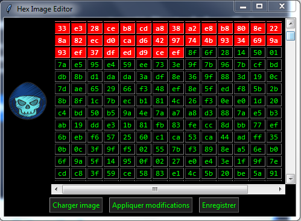

#  Hex Image Editor

Un petit éditeur hexadécimal d’images avec **interface graphique Tkinter**.  
Il permet de charger une image, afficher son contenu en hexadécimal, modifier les octets, et enregistrer l’image modifiée.

---

## 🚀 Fonctionnalités

- Charger une image (**PNG, JPG, JPEG, BMP**).
- Affichage visuel de l’image .
- Visualiser les données binaires sous forme **hexadécimale** (16 octets par ligne).
- **Entête (200 premiers octets)** mise en évidence en **rouge**.
- Modification manuelle des octets directement dans la grille.
- Validation automatique des entrées (2 caractères hex uniquement).
- Application des changements → l’image est mise à jour.
- Sauvegarde de l’image modifiée.

---
##  Aperçu

---
## Technologies utilisées

- **Python 3**
- **Tkinter** → Interface graphique
- **Pillow (PIL)** → Gestion des images
- **NumPy** → Génération d’images bruitées


## 📦 Installation

1. Installer **Python 3** depuis le site officiel (si ce n’est pas déjà fait) :  
   👉 [Télécharger Python](https://www.python.org/downloads/)

2. Vérifier que Python est bien installé :  
   ```bash
   python --version
   ```
   ou 
   ```bash
   python3 --version
   ```
   
3. Cloner le dépôt :
   ```bash
   git clone https://github.com/ton-pseudo/hex-image-editor.git
   cd hex-image-editor
   ```
4. Installer les dépendances :
   ```bash
   pip install pillow numpy
   ```
5. Lancer l’application :
   ```bash
   python hex_image_editor.py
   ```


## 🎮 Utilisation

1. **Charger une image** avec le bouton correspondant.

2. L’image s’affiche à gauche et son **contenu hexadécimal** à droite.

3. Modifier les valeurs hexadécimales dans la grille (2 caractères : `00` à `FF`).

   - Les 200 premiers octets (en **rouge**) représentent l'entête (**Header**), à **ne pas modifier**.
   - Le reste du fichier (en **vert**) peut être modifié librement.

1. Cliquer sur **Appliquer modifications** pour mettre à jour l’image.

2. Sauvegarder avec le bouton **Enregistrer**.


